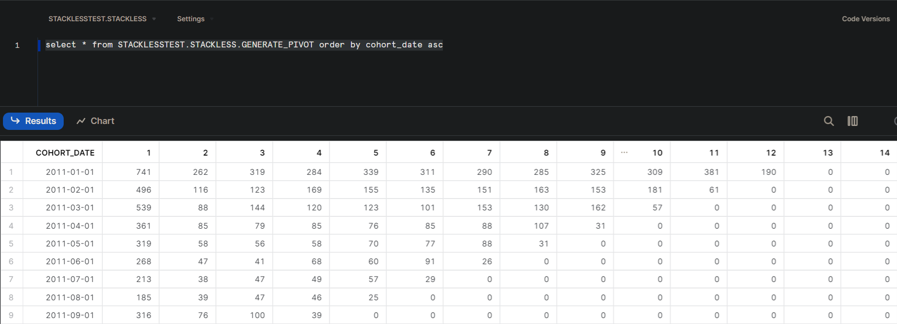

### Creating A Dynamic Customer Cohort Model for Sales Analytics 

# What is a Cohort Table?
(https://www.youtube.com/watch?v=hWomCwhMWe0&t=4s)

A customer retention cohort table tracks customers from their first purchase Month (Period Size),
and tracks if they remain as a customer accross subsequent period time steps. 

# How to Run:
- Check the myscript.sh file for commands needed to run this project. 
# Features
- Dynamically generates pivot Table, which can infer index from table
- Dynamically accepts start date at run time. 

# Technologies
- DBT
- Snowflake

# Will feature:
- Dynamically accepts Period Size for tables
- Fix Model Order Run. 
- 

