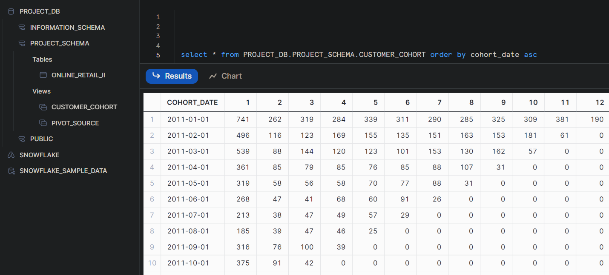

### Creating A Dynamic Customer Cohort Model for Sales Analytics 

# What is a Cohort Table?
(https://www.youtube.com/watch?v=hWomCwhMWe0&t=4s)

A customer retention cohort table tracks customers from their first purchase Month (Period Size),
and tracks if they remain as a customer accross subsequent period time steps. 

# Data:
For this project, I am utlilizing sample data contiaining receipts of purchases by customers over the course of several years

# How to Run:

    - git clone git@github.com:NoahKusaba/Customer-Cohort-Analysis.git

    From here you will need to setup a snowflake account and configure dbt-core locally with the snowflake driver, and configure your credentials to integrate properly. 
    https://docs.getdbt.com/docs/core/installation-overview

    You will also need to create a new database and schema for this project to live in. The pictures in the Readme have it set to DB: "project_db" and schema "project_schema", but you can name it however you like

    To upload the csv file for this project run:
    - dbt seed 

    To generate the final views of the model run the following command. Note that you will need to pass the paramater for the initial period start date: 
    - dbt run --vars '{"initial_period_start": "2011-01-01"}'

    To query the customer cohort model on snowflake run:
    - select * from PROJECT_DB.PROJECT_SCHEMA.CUSTOMER_COHORT order by cohort_date asc

# Features
- Dynamically generates pivot table, which can infer index from table
- Dynamically accepts start date at run time. 

# Technologies
- DBT
- Snowflake